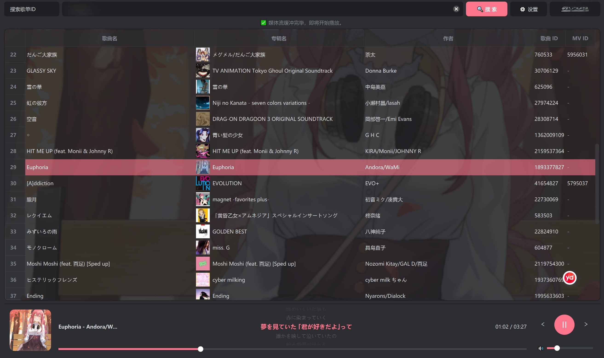
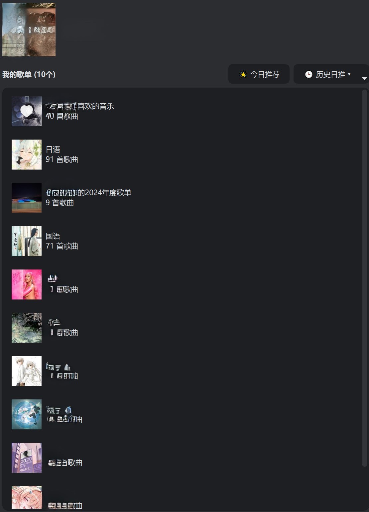

# ☁️ AeroYun (轻云播放器)


**AeroYun** 是一款基于 `Python PyQt5` 编写的轻量级、高颜值第三方网易云音乐客户端。
摒弃臃肿，回归纯粹。项目主打**高级圆角 UI 设计**、**丝滑的异步多线程**以及强大的**单曲/批量下载功能**。通过搭配 `api-enhanced` 增强版接口，为您带来无广告、极速的音乐体验。

## ✨ 核心特性 (Features)

- 🎨 **高级质感 UI**：深度定制的组件样式，全局优雅圆角，视觉体验极度舒适。
- 🚀 **丝滑防假死**：底层采用 `QThread` / `QRunnable` 异步架构，无论是获取庞大歌单还是网络大文件传输，主界面始终保持满帧流畅。
- 🎵 **原生影音引擎**：基于原生 `QMediaPlayer` 构建，完美支持高质量单曲音频与 MV 视频的无缝播放。
- 📦 **硬核下载利器**：
  - 支持单曲及**一键批量下载**。
  - 文件自动保存至根目录 `Downloads` 文件夹。
  - 自动调用 `mutagen` 补全并写入音频 ID3 元数据（包含高清封面、歌手名、专辑名等）。
- 👤 **专属个人空间**：支持在设置中注入账号 Cookies，重启即可解锁“我的歌单”与“每日推荐”。
- 🛡️ **反风控机制**：内置 `fake-useragent` 随机生成请求头，有效降低 API 封禁风险。

---

## 🖼️ 界面展示 (Screenshots)

### 主界面 (Main Dashboard)
> 极简布局，圆角组件，沉浸式听歌体验。


### 个人账号与歌单 (Personal Account)
> 注入 Cookie 后，您的专属日推与收藏歌单尽收眼底。


---

## 🛠️ 技术栈 (Tech Stack)

- **前端 UI & 播放引擎**：`PyQt5`, `PyQt5.QtMultimedia`
- **网络与并发**：`requests`, `fake-useragent`, `urllib3`, `QThread`
- **音频处理**：`mutagen` (处理 mp3/flac 标签元数据)

---

## 🚀 安装与运行 (Installation & Usage)

AeroYun 采用**前后端分离**的思想，需要先在本地启动 Node.js 版的网易云 API 服务。

### 1. 启动 API 服务
本项目强依赖于 [neteasecloudmusicapienhanced/api-enhanced](https://github.com/neteasecloudmusicapienhanced/api-enhanced)。
请确保您的电脑已安装 [Node.js](https://nodejs.org/)。

```bash
# 克隆 API 项目
git clone [https://github.com/neteasecloudmusicapienhanced/api-enhanced.git](https://github.com/neteasecloudmusicapienhanced/api-enhanced.git)
cd api-enhanced

# 安装依赖并启动服务
npm install
node app.js
```
### 2. 运行 main.bat
main.bat 将会自动创建虚拟环境，安装pip软件包。

## ⚙️ 配置指南 (Configuration)

**如何获取并设置个人的专属 Cookie？（解锁个人歌单与每日推荐）**

1. **获取 Cookie**：在电脑浏览器中打开并登录 [网易云音乐网页版](https://music.163.com/)。
2. 按下键盘的 F12 键打开开发者工具（Developer Tools），切换到 **Network (网络)** 面板。
3. 刷新一下网页，在网络请求列表中随意点击一个请求（通常可以找 `weapi` 或带有 `csrf_token` 的请求）。
4. 在右侧的 **Request Headers (请求标头)** 中找到 `cookie:` 字段。
5. **⚠️ 填写规范**：注意剥离前缀！如果浏览器中显示的是 `cookie: xxx`，**您只需要复制后面的 `xxx` 即可**，不要把 `cookie:` 这几个字母也带进去。
6. **应用到播放器**：打开 AeroYun 播放器，进入**【设置】**界面，找到 **“Cookies 编辑框”**，将刚才复制的纯净 Cookie 粘贴进去。
7. **重启生效**：保存并重新启动 AeroYun 播放器，即可在个人账号界面无缝漫游您的私有歌单与每日推荐！
